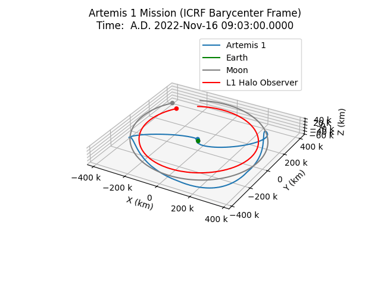
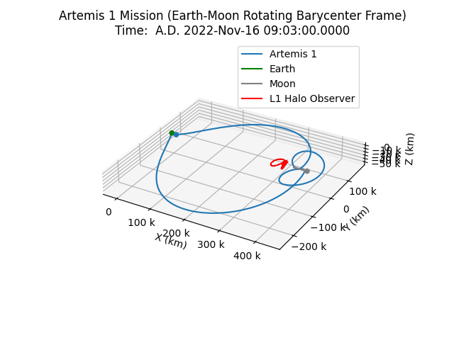

# artemis_detection

This is a quick project where I wanted to try coding up a simulation of a space surveillance mission trying to spot the Artemis I mission. Uses data from [JPL Horizons/Solar System Dynamics](https://ssd.jpl.nasa.gov/horizons/).

